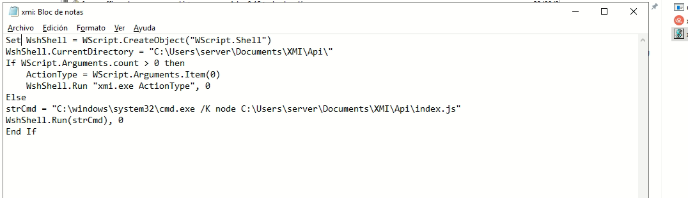
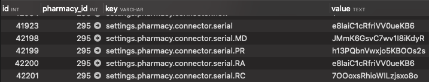
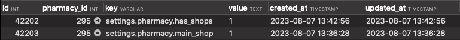
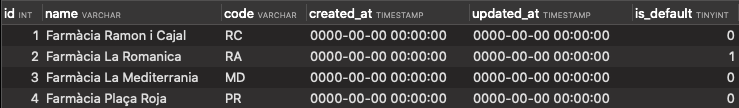
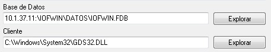

# Farmaoffice

## GENERAL

### Crear farmacia nova

1) **Se crea la farmacia en producción (CRM FarmaOffice)**

2) **Se crea el subdominio/dominio para la farmacia:**

```sh
http://fo-01.foffice.ovh/dominios.html

```
**user:** farmaoffice
**pass:** [el de bibloos]

> **OBSOLETO (se crea automático):** 3) Crear certificado SSL

4) **Si no tiene web, revisar que existe setting:**

```sh
settings.pharmacy.hasWeb = 0
```
Si tendrá web asociada, revisar creación web


### Actualizar BBDD desarrollo nueva farmacia

1) Importar base de datos farmaoffice + base de datos de la farmacia, o importar backup completo de producción a desarrollo: [Actualitzar DB local amb backup de producció](http://wiki.bibloos.com/index.php?title=Actualitzar_DB_local_amb_backup_de_producció)
   
2) Ejecutar el siguiente sql:

```sh
 update pharmacy set server_name = replace(replace(origin_server_name, '.com', '.test'), '.dev', '.test')
```

### Proceso crear web

0) Crear farmacia como se indica en el apartado anteriror

1) Executar 

```sh
php artisan pharmacy:create-web <nom_farmàcia>
```

2) Modificar /etc/hosts vhosts de vagrant per poder accedir per url

3) Actualizar el directorio de uploads con el de producción (bajarse cambios)

```sh
 rsync -rtazh -v --delete root@fo-01:/var/www/farmaoffice.com/public/uploads/. $HOME/vestibule-referendum/farmaoffice/public/uploads 
```
> deberíamos mirar como hacer un rsync para no tener que bajarlo todo

### Proceso deploy

1) Ejecutar script de deploy

2) Cambios en DB: Subir settings. Seleccionarlos en desarrollo, ponerlos con el id a nulo (para que sea autoinc) y ejecutarlos como INSERT IGNORE (en principio se deben mantener los setting de producción ya que no se machacan después de importarlos en dev)

3) Si existen migraciones por farmacia deberemos ejecutarlas (ver [Ejecutarlas Migrations](http://wiki.bibloos.com/index.php?title=Crear_Migrations))

4) Cambios en DB: Insertar script de cambios (page, page_translations, post, post_translations, etc.)

5) Subir otros ficheros que no se hayan subido con el deploy (si hubiéramos añadido imágenes en /uploads) 


### Crear Migrations


#### MIGRACIONS PER A TOTES LES FARMÀCIES:

Si per exemple volem crear la migració 'addMetaFieldsToContentTables', executem (projecte farmaoffice):

```SH
php artisan migrate:make --path=/app/database/migrations/pharmacy/ addMetaFieldsToContentTables
```

Una vegada creat el fitxer, l'editem utilitzant el format de migracions de Laravel.

Executem per a totes les bases de dades de farmacies la migració (projecte farmaoffice):

```SH
php artisan migrate:changes-pharmacy
```

#### MIGRACIONS GENÈRIQUES (FARMAOFFICE)

Crear migració a desenvolupament per la base de dades genèrica (projecte farmaoffice):

```SH
php artisan migrate:make --path=/app/database/migrations/generic/ AddUrlFedicomFieldToWarehousesTable
```

A desenvolupament executem migrate amb el path 'generic' on hem de deixar les migracions per a la base de dades farmaoffice:

```SH
php artisan migrate --path=/app/database/migrations/generic
```

**DEPLOY:** A producció el deploy executarà automàticament les migracions, tant de farmàcia com genèriques. 

## IMPORTACIÓ DADES FARMÀCIA

### Introducció

Les farmacies tenen dades de les seves ventes a partir d'un sistema de logistica proporcionat per una entitat privada. Farmaoffice recull aquestes dades a partir d'un aplicatiu creat per un altre entitat anomenat "XMI". El connector neix per la necessitat de substituir el XMI ja que no es té el control total i quan falla desconeixem moltes vegades perquè ha passat.

Moltes de les farmacies (anteriors) i noves ja tenen el nou connector instal·lat a les seves botigues però d'altres encara no, la tendencia és anar incorporant el nou en aquelles que encara fan servir l'antic.

### Repositori connector

[https://bitbucket.org/bibloos/farmaoffice-connector/](https://bitbucket.org/bibloos/farmaoffice-connector/)

## Repositori actualitzador update.exe

S'executa per part del connector quan detecta que té una nova versió per descarregar. Baixa el ZIP del servidor i descomprimeix al servidor de la farmàcia.

[https://bitbucket.org/bibloos/connector-update/src/master/](https://bitbucket.org/bibloos/connector-update/src/master/)

## Instal·lador del connector

És el projecte que instal·la el connector al servidor de la farmàcia en format assistent, permetent escollir el PGOF (Farmatic, altres), instal·lant node i altres dependències.

> NOTA: Confirmar que a bitbucket tinguem l'última versió que hi ha dins la màquina virtual [https://bitbucket.org/bibloos/instalador-conector/src](https://bitbucket.org/bibloos/instalador-conector/src)


> Bootstrapper1 és el projecte instalador, amb el Visual Studio.

 A Windows 7 Farmatic:


A Windows 7 Farmatic:

```sh
c:\Users\Administrator\Documents\Developing\restoration\XMI.sln
```

| **Categoria** | **Descripció** |
|---------------|----------------|
| Arxius        | `src/` per arxius a instal·lar/necessaris. |
| WIX           | Carpeta `SetupProject1/` per canviar les finestres/steps. |
| C#            | Carpeta `CustomAction1/` per la programació que executen les finestres. |


Sobre "Solution Explorer"=>Rebuild Solution per nou compilat (tenir en compte mode Debug/Release afecta a carpeta destí compilat).

Per publicar l'instal·lador del connector:

- Repositori [https://bitbucket.org/bibloos/instalador-conector](https://bitbucket.org/bibloos/instalador-conector)
- Generar nou compilat 
```sh  
FarmaOffice_Conector.exe
```

- Publicar nou EXE a 
```sh
  /var/www/farmaoffice.com/public/conector/
```

## Links d'interès

- [https://bitbucket.org/bibloos/connector-update](https://bitbucket.org/bibloos/connector-update)
- [https://bitbucket.org/bibloos/instalador-conector](https://bitbucket.org/bibloos/instalador-conector)
- [https://bitbucket.org/bibloos/empaquetador-conector](https://bitbucket.org/bibloos/empaquetador-conector)
- [http://wixtoolset.org/](http://wixtoolset.org/)

## Comportament

### Com funciona l'antic connector?

L'aplicatiu XMI genera sentències sobre el programari de logística de les farmàcies que tenen "Farmatic" per obtenir les dades del dia a dia, i genera un fitxer XML per cadascuna de les taules que té la farmàcia. Un cop obté tota la informació, aquesta es comprimeix en un arxiu .zip i s'envia via protocol FTP al nostre projecte CORE FO. Un cop obtenim les dades, nosaltres tenim un procés que s'encarrega d'importar el contingut del zip cap a la base de dades.

### Com funciona el nou connector?

El connector nou manté la mateixa finalitat que l'XMI però va més enllà. Quan el connector s'inicia, pregunta a FO si està actualitzat, és a dir, si la farmàcia té el connector a la última versió (estable). En cas que el connector veu que cal actualitzar-se, arrenca un procés nou d'actualització i es torna a arrencar sol. Quan el connector està a la última, té una sèrie de tasques que ha de realitzar periòdicament:

#### Tasques periòdiques

Cada 15 minuts des que s'ha iniciat, pregunta a FO si ha de fer alguna cosa, i les preguntes que es fa i que FO li contesta són:

- Tinc que actualitzar-me de versió?
- Tinc que baixar-me nova configuració de la farmàcia?
- Tinc que llançar alguna consulta a les dades?

> Nota: Cadascuna de les preguntes que es fa el connector, estan explicades més endavant.

#### Procés d'exportació de dades

Una de les configuracions que manté el connector és a quina hora ha de llençar l'exportació de les dades cap a FO, i el procés que genera quan és l'hora és:

1. Mira sobre quin índex dels dos que té cada farmàcia ha de volcar les dades, el seteja i bloqueja el procés.
2. Va taula per taula de la configuració i agafa per blocs totes les dades que necessita. Aquest procés es loggeja a la taula logs de la API.
3. Quan arriba a la taula de les ventes, només agafa aquelles que encara no hagi importat FO.
4. A cada bloc generat de notació JSON s'envia a Api FO per tal que els guardi a l'ElasticSearch (indexador de continguts).
5. Quan acaba el procés, es seteja l'índex en el qual s'estava apuntant i es queda a l'espera.


## Crear un nou connector

Per les farmàcies noves, en el procés de creació al backoffice ja es fa automàtic i segons el tipus de connector introduït (Farmatic-NEW, Nixfarma, IOFWIN).

Entrem al servidor, i des de l’arrel del projecte (`/var/www/farmaoffice.com`) executem:

```sh
php artisan pharmacy:create-connector <pharmacy_dbname>
```

Escollim el tipus de connector a crear (Farmatic-NEW, Nixfarma, IOFWIN). 


Aquest procés crearà un nou connector:

    1. Settings a farmaoffice_pharmacydbname
    2. Entrada nou connector a API.user
    3. Índex a Elastic Search.

**IMPORTANT:** cap d'aquests tres punts ha d'estar creat abans de procedir amb la creació del connector. Si existeix, cal esborrar-ho abans.


## Crear més d'un connector

Per crear múltiples connectors per una única farmàcia, cal tenir un registre per cadascun dels connectors a la taula `FARMAOFFICE.PHARMACY` (Es podria fer que no sigui obligatori, ja que no utilitzem aquesta BD en la majoria dels casos, ja que es fa una importació sobre una única BD principal).

### Possible solució: 14/12/2020 (pendent de verificar)

1. Es tenen que crear la primera farmàcia de manera normal.
2. La segona també, però no es crea a ecobuy.
3. Després, a la base de dades de la farmàcia, a la taula `SHOP`, és necessari crear les files dels diferents connectors. Aquí es detalla el default.

### Exemple


| Nom Farmacia                     | CODE | DEFAULT |
|----------------------------------|------|---------|
| Farmacia Carmen Subirana Corona  | CA   | 1       |
| Farmacia Maria Corona i Pol      | MA   | 0       |

Després, a la taula `settings`, és necessari introduir els següents settings adjuntant el code de les files anteriors.

Duplicar el principal i afegir el code.

```plaintext
settings.pharmacy.connector.serial.CA[CODE TAULA SHOP], ybnghu57j25mNRg5Ly7j, [API KEY DE USER tabla api]
settings.pharmacy.connector.serial.MA[CODE TAULA SHOP], 7LnYwwyZzEw2RSjWAM6V, [API KEY DE USER tabla api]
```

## Crear un nou connector FOGO

Executar l'artisan `pharmacy:create-connector-go` on ens demanarà l'ID farmàcia a activar i el tipus de connector. Crearà un nou registre a la taula `api.users`, que quan s'executi Elàstic crearà un nou índex per la farmàcia.

### Configuració dels settings per la gestió de l'stock a la compra online

Un cop estigui en funcionament, cal crear els settings al respecte per la gestió del stock a la compra online en cas que en tingui:

1. **`settings.pharmacy.e_commerce.products.warning_no_stock`**  
   Determina que surti el warning al carret quan no hi ha stock. Comentar que només es pot desactivar si el setting està a `0`. Si està a `1` o no té el setting creat, per defecte surt el warning al carret també.

2. **`settings.pharmacy.e_commerce.products.disable_no_stock`**  
   Determina que surti el "NO DISPONIBLE" en cas que un producte no tingui stock. Només s'activa quan el setting està a `1`.

   > Comentar que el "NO DISPONIBLE" també pot sortir si el preu del producte és `0`, cosa que no hauria de ser-ho mai.

   Aquestes condicions només són aplicables a productes amb codi nacional. Evidentment, en cas contrari no tenim l'stock.

**Important a realitzar per finalitzar el procés**

### Per activar el servei A GO: 
```sh
php artisan service:enable ConnectorService --pharmacy_id=99999
```

---

# Importació de clients/vendes a FO

Si volem executar una importació de forma manual (ES -> FO), entrem al servidor i, des de l’arrel del projecte (`/var/www/farmaoffice.com`), executem:

### Per TOTS ELS CONNECTORS:
```sh
php artisan api:import-farmaoffice
```

### Pel connector antic:
```sh
php artisan import:clients
```

### Pel connector nou:
```sh
php artisan api:import [--pharmacy_id=NN]
```

### Pel connector IOFWIN:
```sh
php artisan api:import-iofwin
```

### Pel connector NIXFARMA:
```sh
php artisan api:import-nixfarma
```

---

## Actualització dels comptadors dels grups:
```sh
php artisan listing:nusers
```
# Aplicatiu

## Tecnologia

- **NodeJS v4.4.7** - Connector  
- **Wix Toolset** - Instal·lador  

## Màquina Virtual (Farmatic/IOFWIN/NIXFARMA)

Existeix una còpia de la màquina virtual Windows 7 per desenvolupar el connector, empaquetador i instal·lador, al DiskStation:

`DiskStation/Projectes/FarmaOffice/Conector/Màquina Virtual`

A data **20180418**, l'arxiu a utilitzar amb els 3 ERP és:

`Windows 7 FAR_IOF_NIX.ova`

---

## NIXFARMA

### Per accedir a una BD Nixfarma d'un client:

1. Baixar programa **SQLDbx**  
2. Executar  
3. Posar dades d'accés:

   - **Server**: NIXFARMA  
   - **Schema**: appul  
   - **User**: consu  
   - **Password**: consu  
   - **Connect As**: Normal  

A partir d'aquí, ja estem dins la BD i podem fer consultes, exportar dades, i estructura de taules (botó dret sobre la taula "CREATE script").

### Notes:

- **20180928**: Si té multiempresa a NIXFARMA, cal marcar una d'elles com "default" a la taula `SHOPS`.  
- **20211025**: Si hi ha problemes al configurar l'ODBC, mirar Connexions ODBC a l'apartat de Nixfarma i comprovar que on surt el **Data Source Name**, posar-hi el que hi hagi al camp `origin_dsn` de la taula `users` a la BBDD `api`.

# OFWIN

## Instal·lació

Podem revisar la documentació de com crear un accés a BD IOFWIN al document:

`DiskStation/Projectes/FarmaOffice/Conector/IOFWIN/201903_Accés_IOFWIN-Firebird ODBC.pdf`

### Passos:

1. Mirar propietats del sistema i comprovar si és de 32/64 bits.  
2. Descarregar i instal·lar **FIREBIRD** via web Firebird la versió de 32/64 bits.  
3. Seleccionar versió 32/64 bits de **ORIGEN ODBC**.  
4. Iniciar **ORIGEN ODBC**:
   - Afegir
   - Seleccionar **FIREBIRD**
   - **Name**: IOFWIN  
   - **Description**: Farmaoffice ODBC  
   - **Base de datos**: Buscar arxiu dins carpeta `IOFWIN/DATOS`  
   - **Client**: NULL  
   - **Compte base de dades**:  
     - **User**: SYSDBA  
     - **Password**: masterkey  

5. Crear settings:

   ```plaintext
   settings.pharmacy.connector.iofwin = 1
   settings.pharmacy.connector.new = 1 (normal) o 2 (IOFWIN)
   ```

### PORTS

Cal que els ports 80/443 estiguin oberts al servidor amb IOFWIN.

### **Connectivitat amb BD IOFWIN**

Per accedir a la BD, revisar estructura i editar, es pot utilitzar el següent software lliure:

[SQLDbx](https://www.sqldbx.com/)

Cal:

    Configurar un accés ODBC [Connexions ODBC Iofwin](http://wiki.bibloos.com/index.php?title=Connexions_ODBC)
    Configurar connexió a BD IOFWIN segons credencials anteriors

# Distribució

## Entorns >= NT6 (la majoria dels casos)

Per la seva distribució ja no és problemàtica, ja que es compta amb un instal·lador que genera la tasca programada i la pròpia integració del connector, instal·lant les dependències necessàries perquè funcioni (**Node**).

---

## Entorns Windows XP

En entorns més antics com **Windows XP** i **WinServer 2003**, es manté una altra versió del connector. Aquesta no compta amb un instal·lador i cal realitzar el mateix procés manualment.

### Passos:

1. Comprimir la carpeta del `DiskStation/Projectes/FarmaOffice/Conector/Instalaciones XP`.  
2. Pujar-la al servidor de la farmàcia.  

La carpeta conté tots els arxius necessaris:  
- Un exemple de tasca programada en format **XML** per a la seva instal·lació.  
- El **MSI** del Node per ser instal·lat.  
- El propi connector.  

### Limitacions:

El funcionament del connector d'aquesta versió és més limitat, ja que:  
- No és actualitzable.  
- No pot preguntar per nova configuració en temps "real".  

### Funcionament:

1. S'engega i carrega la configuració.  
2. Executa el procés d'exportació de les dades (fent el switch entre índex de **ES**).  
3. Es tanca.

# Actualitzar versió del connector per les farmàcies

El canvi a una nova versió del connector farà que el connector de la farmàcia es descarregui i actualitzi l'arxiu des de:

[http://api.farmaoffice.com/downloads/Api.zip](http://api.farmaoffice.com/downloads/Api.zip)

## Passos previs

Abans de procedir, cal fer deploy del connector amb la versió etiquetada a **Bitbucket**:

```sh
sh /var/scripts/deploy_connector.sh 1.5.X

```
**Juny 2019: s'afegeix al procés de DEPLOY l'obfuscate del codi JS.**

Veure [obfuscator.io](https://obfuscator.io/)

GITHUB [obfuscator.io](https://github.com/javascript-obfuscator/javascript-obfuscator)

**NOTA:** En principi sempre baixa última versió de "master", la versió a Bitbucket no es fa servir...

**Per saber quina versió tenim en funcionament, cal executar: ***

```SH
GET http://api.farmaoffice.com/v1/setup?token=TOKEN_FARMACIA
```

 Per exemple (token Farmàcia Guarc):

```http
GET http://api.farmaoffice.com/v1/setup?token=j9kXsLc16Ed8w0y2slnIs58MdOjHhgaM
```

**Per canviar la versió, cal executar:**

```http
POST http://api.farmaoffice.com/v1/setup/upgrade-version/custom?token=TOKEN_FARMACIA&version=1.4.X
```

 Per exemple, recomanat amb POSTMAN/Insomnia:

```http
POST http://api.farmaoffice.com/v1/setup/upgrade-version/custom?token=j9kXsLc16Ed8w0y2slnIs58MdOjHhgaM&version=1.4.7
```

# Resolució de problemes freqüents (RPF)

Aquí poden anar enllaços del drive o altres fonts externes que ens permetin entrar amb més profunditat sobre la resolució del problema.

---

## Error al exportar les dades (`httpResponse.statusCode undefined`)

Si al exportar amb terminal veiem un error que diu `Cannot read property 'statusCode' of undefined`, reduir el `max_rows` i tornar a provar.

---

## El connector diu que està actualitzat però no ho està

1. Descarregar l'última versió de [http://api.farmaoffice.com/downloads/Api.zip](http://api.farmaoffice.com/downloads/Api.zip).
2. Passar-li pel **TeamViewer** a través del botó **Transferència de fitxers** (trobar botó).
3. Un cop ho tenim al seu servidor, substituir per la carpeta `Api` dins de `XMI`.

---

## Error al iniciar el connector

Si iniciem el connector per terminal i veiem que no carreguen els settings, haurem de validar que el JSON que li passem amb la configuració (BBDD: `api`, Taula: `users`, Columna: `list_tables`) sigui correcte utilitzant aquesta eina: [JSON Formatter](https://jsonformatter.curiousconcept.com/).

## Tasques

Afegir tasca programada perque tanqui el connector i el node cada dia a les 9 del matí per exemple. Cal mirar a quina hora s'executa la tasca programada que obre el connector. En cas d'afegir aquesta tasca de tancar el connector, cal revisar la tasca programada que s'executi a cada hora. (taskkill)

Aplicar la següent modificació del script de l'arxiu .xmi que obre el Connector quan s'executa la tasca programada en cas de que falli l'execució de la tasca. Script tasca programada error.png



## Esborrar connector

Per eliminar un connector, cal executar les següents comandes a la base de dades:

```sh
DELETE FROM farmaoffice.setting 
WHERE value IN (
    SELECT u.api_key
    FROM api.users u 
    WHERE status = 0 
      AND u.last_connector_import < NOW() - INTERVAL 180 DAY
      AND u.last_connector_import IS NULL
);

DELETE FROM api.scheduled_queries sq
WHERE sq.user_id IN (
    SELECT u.id
    FROM api.users u 
    WHERE status = 0 
      AND u.last_connector_import < NOW() - INTERVAL 180 DAY
      AND u.last_connector_import IS NULL
);

DELETE FROM api.logs l
WHERE l.pharmacy_id IN (
    SELECT u.id
    FROM api.users u 
    WHERE status = 0 
      AND u.created_at < NOW() - INTERVAL 180 DAY
      AND u.last_connector_import IS NULL
);

DELETE FROM api.users 
WHERE status = 0 
  AND created_at < NOW() - INTERVAL 180 DAY 
  AND last_connector_import IS NULL;

```


## API connector

El connector comunica amb farmaoffice utilitzant api.farmaoffice.com

Repositori API LUMEN

## Importació dades ElasticSearch a FO

Si volem executar una importació de forma manual (ES -> FO)

Entrem al servidor FO-01, i desde l’arrel del projecte (/var/www/farmaoffice.com) executem:

Pel connector FARMATIC (antic)

```sh
php artisan import:clients
```

Pel connector FARMATIC (nou)

```sh
php artisan api:import [--pharmacy_id=NN]
```
ID Farmàcia: Segons la taula FARMAOFFICE.PHARMACY

Pel connector IOFWIN

```sh
php artisan api:import-iofwin
```

Pel connector NIXFARMA

```sh
php artisan api:import-nixfarma
```

> NOTA (2018-09-28): Si té multiempresa a NIXFARMA, cal marcar una d'elles com "default" a la taula SHOPS.

Opcional: Després d’això cal actualitzar els comptadors dels grups:

```sh
php artisan listing:nusers
```

### Importació de dades per múltiples shops/grups

1. S'han d'afegir els següents settings a la BBDD de farmaoffice FO-01 a la farmàcia principal (default shop) per poder rebre les dades de les altres farmàcies (shops) i importar-les cap a la BBDD individual de la farmàcia. Exemple amb Dualfarma:  
   - **settings.pharmacy.connector.serial.MD:**  
     - El `.MD` identifica a la farmàcia no principal amb el `code` de la taula `shops` de la BBDD individual de la farmàcia principal.  
     - Aquest setting conté la `api_key` del connector de la farmàcia no principal.  
     - Es poden afegir tants com es necessitin segons nombre de farmàcies.  
     - Aquí també posem la farmàcia principal amb el seu `code` corresponent.
   - **settings.pharmacy.has_shops:**  
     - Determina que la farmàcia té varies `shops` associades.  
     - Aquest setting es posa a la farmàcia principal.
   - **settings.pharmacy.main_shop:**  
     - Determina que la farmàcia és la principal dins del grup de farmàcies en el moment de fer la importació de dades cap a FO.
  


**HISTORIAL DEL FITXER**

*S'ha produït un error en crear la miniatura: /bin/bash: line 1: /usr/bin/convert: No such file or directory Error code: 127*



**HISTORIAL DEL FITXER**

*S'ha produït un error en crear la miniatura: /bin/bash: line 1: /usr/bin/convert: No such file or directory Error code: 127*


   1. S'han d'afegir els següents registres a la BBDD de la farmàcia principal per poder funcionar dins de la importació com a farmàcia principal:
       - Taula shops: Afegir cada farmàcia inclosa la principal amb el seu nom (camp lliure) i el code que s'utilitza per identificar a cada shop en els settings de les api_key a la BBDD farmaoffice de la farmacia principal. Aquí s'ha de posar el camp default a 1 a la farmàcia principal per identificar-la com principal (default shop).




**HISTORIAL DEL FITXER**

*S'ha produït un error en crear la miniatura: /bin/bash: line 1: /usr/bin/convert: No such file or directory Error code: 127*

## ElasticSearch i Kibana

### Configuració general

```SH
- Kibana i ElasticSearch al servidor fo-02 de OVH (151.80.27.29)
- Kibana http://172.16.0.2:5601 (accesible amb VPN)
- Elastic http://172.16.0.2:9200
```

### Paths al servidor fo-02

```sh
- /var/lib/elasticsearch (bins)
- /var/log/elasticsearch (logs)
- /etc/elasticsearch (configs)
```


### Commands

```SH
Test index status 
curl -XGET "http://172.16.0.2:9200"
```

```SH
Test service status
systemctl status kibana
systemctl status elasticsearch
```

```SH
Start/stop service
sudo systemctl start elasticsearch
sudo systemctl stop elasticsearch
sudo systemctl start kibana
sudo systemctl stop kibana
```

```SH
Check ports
sudo netstat -tlpn
```

```SH
Edit configs
nano /etc/kibana/kibana.yml
nano /etc/elasticsearch/elasticsearch.yml
```

### LINKS

- [Introducción a Kibana - Adictos al Trabajo](https://www.adictosaltrabajo.com/2015/12/27/introduccion-a-kibana/)
- [How to Use Kibana Dashboards and Visualizations - DigitalOcean](https://www.digitalocean.com/community/tutorials/how-to-use-kibana-dashboards-and-visualizations)


## instal·lació / manteniment de connectors

En aquesta pàgina està tota la informació referent a la instal·lació / manteniment dels connectors, com també informació de com solucionar possibles incidències i errors.

**Important: estem treballant en el servidor de la farmàcia, s'ha d'anar amb molta precaució amb el que es fa i també el mateix a la base de dades de api del servidor FO-01.**

### Instal·lador

1. Verificar a la taula `api.users` que l'índex del connector està creat correctament.
2. En el servidor de la farmàcia, copiem l'arxiu de l'instal·lador a la carpeta de descàrregues: [Descarregar instal·lador](https://drive.google.com/file/d/19BwI8Eq3fTQs3eGVeXM2f_kPo5ET_fBf/view?usp=sharing).
3. **(NOMÉS GO)** Mentre s'està pujant l'arxiu, s'ha d'activar el servei a través de la comanda:
   ```bash
   php artisan pharmacy:create-connector-go
   ```
   ens demanarà el id de farmàcia i el tipus de conector.

4. S'ha de posar el `settings.pharmacy.connector.farmaofficego` a `0` per evitar errors amb la importació dels connectors.
5. Executem l'instal·lador com a administrador i anem seguint els passos que ens mostra.
6. En el pas d'introduir el número de sèrie (`api_key`), busquem a la taula `api.users` el camp `api_key` de l'índex amb el qual estem treballant. Molt important d'agafar la `api_key` correcte, ja que estem exportant dades REALS de la farmàcia cap a la nostra base de dades i no podem ajuntar dues bases de dades de farmàcies separades.
7. Si és un connector **Farmatic**, ens demanarà les credencials per connectar-nos a la base de dades de Farmatic: El nom del servidor en el qual estem treballant.L'usuari sempre és `'sa'`. La contrasenya pot ser qualsevol que apareix a la base de dades de `api.users`. En cas de no trobar la contrasenya correcta, hem de trucar a la farmàcia perquè la introdueixin ells.
8. Un cop introduïdes totes les dades, començarà la instal·lació del connector i el mateix instal·lador ens avisarà quan estigui completada.


### Configuració arxius connector (XMI)

1. Un cop realitzada la instal·lació, anem a `C:\Program files(x86)` i anem a propietats del directori `\XMI`. Desmarquem el check de l'atribut de **només lectura**. A l'apartat de **seguretat**, anem a **afegir** i afegim l'usuari `'tots'`. Apliquem els canvis i donem a **acceptar**.

2. Entrem dins del directori de `\XMI` i apareixeran dos directoris i un arxiu executable. Hem d'esborrar aquest executable i afegir aquest: [Descarregar executable](https://drive.google.com/file/d/1E1O0pFHb1zcwE6kDZpaHy1rGE-kcD3a1/view?usp=sharing).

3. Un cop substituït l'executable, anar al directori `\Api`.  
   - En el directori `\bin` **no s'ha de realitzar cap acció**.

4. Dins de `\Api`, anem primer al directori `\bin` i modifiquem l'arxiu `xmi.vbs`: Editem la ruta que apareix per `"C:\Program files(x86)\XMI\Api"`.

5. A continuació, sortim de `\bin` i dins del directori de `\Api` accedim a la carpeta `\config`: Editem l'arxiu `settings.json` modificant el **HTTPS** de l'URL de `pro` per **HTTP**.


### Iniciar el connector

1. Fets els dos punts anteriors, ens quedem al directori de `\Api` i en la ruta de l'explorador d'arxius escrivim `cmd` per obrir el terminal des del mateix directori.
2. En el terminal introduïm la comanda:
   node index.js
per executar el connector. S'iniciarà el connector i es començarà actualitzar.

3. Si estem instal·lant el connector per primera vegada i és del mòdul de compres (**Eco-Buy, Hartmann i Pierre Fabre**), hem de realitzar el pas **Extreure la id_last_reception per connectors de mòdul de compres**.
4. Un cop s'hagi actualitzat, el programa s'iniciarà i apareixerà la icona a la barra de tasques.  
   - Fem clic dret sobre la icona i seleccionem **Sortir** per tancar el programa.
5. S'ha de canviar el `value` del `settings.pharmacy.connector.farmaofficego` a `1` per poder fer l'exportació.
6. Tornem a executar el terminal des de l'explorador d'arxius i introduïm de nou la comanda:
   ```
   node index.js
   ```

7. Un cop iniciat el connector, anem a la icona i fem clic dret i li donem a Exportar. Això iniciarà l'exportació de dades i en el terminal podrem veure els logs de l'exportació.
8. En els logs apareixerà un avís en el qual es mostrarà quan hagi acabat l'exportació i el connector s'apagarà automàticament tot seguit.


### Tasques programades

1. Ara ens toca crear la tasca programada de tancar el connector cada dia. Anem al **programador de tasques** i, un cop a dins, seleccionem **"crear tasca bàsica"**.
2. Al primer pas, li fiquem de nom **"farmaoffice_close"**. Al segon pas, deixem seleccionada l'opció de **"diàriament"**. Al tercer pas, modifiquem l'hora d'exportació i fiquem les **9:45 del matí**. Al quart pas, afegim en el programa **"taskkill"**, i en els arguments fiquem:
     ```bash
     /F /IM node.exe
     ```
     Això finalitzarà el procés del node.
    A continuació, es mostrarà el resum de la tasca i, si tot està correcte, la creem.

3. Ara ja tenim les dues tasques programades:  
La d'iniciar cada hora, que és **"farmaoffice"**.  
La de tancar el connector, que és **"farmaoffice_close"**.
 Provem que funcionen correctament executant-les respectivament.

4. Si tot està correcte en el pas anterior, ja es trobarà realitzada la instal·lació. Només ens faltarà tancar les pàgines que haguem obert i ja podem avisar al client que el connector està instal·lat correctament.


# Extreure la id_last_reception per connectors de mòdul de compres

1. Hem d'anar a la taula `api.scheduled_queries` i duplicar l'última fila de la taula afegint en el `user_id` el `id` del índex amb el qual estem treballant de la taula `api.users`, esborrem el camp `last_result` i fiquem el `status` a 0.
2. Haurem d'esperar entre 10-15 minuts per obtenir el camp `last_result`.
3. Un cop tenim el `last_result`, agafem el JSON que ens retorna i haurem d'agafar una `id_reception` d'un any enrere.
4. Hem de ficar la `id_reception` al camp `api.id_last_reception`.
5. Un cop fet aquest últim pas, ja podem continuar amb la resta del procés d'instal·lació.


# Connexions amb servidor de Galícia

Aquestes són les dades necessàries per fer la sol·licitud de connexió a servidors de Galícia per poder instal·lar/revisar connectors:

1. **Adreça departament Ereceita** (encarregats de gestionar les connexions):  
      - `sys.ereceita@redfarma.org`  
      - `informatica@cofc.es` (posar en còpia).

2. **Horari de connexions:**  
      - Les connexions es concediran entre les **10:00 h** fins a les **14:00 h**.

3. **Antelació de la sol·licitud:**  
      - La sol·licitud s'ha de fer amb un mínim de **24 h d'antelació**.

4. **Programa necessari per a la connexió:**  
      - La connexió només es pot fer a través d'**ISL Light**.  
      - [Enllaç per descarregar el programa](https://www.islonline.com/es/es/downloads/) (ISL Light, no versió client).

5. **Dades necessàries a incloure dins de la sol·licitud:**  
      - Nom de l'empresa que sol·licita la connexió (**Farmaoffice SL**).  
      - Data en la qual es farà la connexió (sempre amb **24 h d'antelació**).  
      - Nom o dades del titular o titulars de la farmàcia a la qual volem connectar-nos (també recomanat posar el nom d'empresa de la farmàcia).  
      - Província a on es troba la farmàcia.

# Problemes i incidències

1. **Hi ha un procés de node obert i fa que el nostre connector no funcioni.**  
   - Tancar aquest procés i revisar que no afecti alguna altra aplicació.

2. **Driver de la connexió ODBC no trobat.**  
      - Haurem de configurar la connexió ODBC, tota la informació sobre aquest tema es troba a la pàgina **Connexions ODBC Iofwin**.  
      - Un cop configurada, ja podem tornar a executar el procés d'exportació.

3. **Problemes amb les tasques programades.**  
    Amb la tasca d'iniciar el connector, si no funciona, verificar que no s'ha modificat l'arxiu `\XMI\bin\xmi.vbs`.  
       - Si s'ha modificat, s'ha de posar la ruta `"C:\Program files(x86)\XMI\Api"`.  
       - Si continua fallant, instal·lar el connector de nou.  
       - També es pot crear la tasca d'iniciar manualment, d'aquesta manera evitarem problemes amb els permisos d'usuari.
    Existeix la possibilitat de canviar el tipus d'execució que es fa en l'arxiu `\XMI\bin\xmi.vbs`, per executar directament amb el CMD de Windows.  
       - Per això, haurem de modificar la condició del `else` per:
       ```vbscript
       strCmd = "C:\windows\system32\cmd.exe /K node C:\Program Files (x86)\XMI\Api\index.js"
       WshShell.Run(strCmd), 0
       ```

4. Amb la tasca de tancar el connector, s'ha de revisar que estigui ben creada i que l'argument sigui el correcte.  
      - Si no s'executa, activar el check d'executar amb els privilegis més alts.

5. **La instal·lació dona problemes en el servidor o no es pot instal·lar en aquest.**  
      - Realitzar la instal·lació a un ordinador diferent del servidor el qual tingui connexió de xarxa amb el servidor.  
      - **(Farmatic):** En el procés de la instal·lació, en el pas de les credencials de la base de dades de Farmatic, ficar el nom del servidor.  
      - **(IofWin i Nixfarma):** Verificar que es troba configurada la connexió ODBC de 32 bit en el servidor per poder realitzar la connexió amb la base de dades del programa de gestió.

6. **El connector s'inicia, però no exporta dades.**  
      - Veure a quina hora es posa en marxa el connector i fer una prova canviant el camp `api.export_hour` a 5 minuts després de l'inici.  
      - Si exporta a l'hora indicada, canviar el `user_timetable` afegint l'hora indicada prèviament en el `export_hour`.

7. **No es pot fer el primer `node index.js` (the edge module has not been pre-compiled for node.js version).**  
      - Haurem de desinstal·lar el node de l'ordinador de la farmàcia.  
      - Després descarreguem l'instal·lador de la versió 4.4.7 del node:  
     [Descarregar Node.js 4.4.7](https://nodejs.org/dist/v4.4.7/) -> `node-v4.4.7-x64.msi`.  
      - Ho posem a la carpeta de descàrregues de l'ordinador de la farmàcia i l'executem per fer la instal·lació.  
      - Desinstal·lem i tornem a instal·lar el connector per si de cas.

8. **Driver ODBC de 32 bit amb connexió externa al servidor.**  
      - Hem de configurar la ruta a l'arxiu de la base de dades de manera que connecti amb un servidor extern. Per exemple:  
     `10.1.37.11:/IOFWIN/DATOS/IOFWIN.FDB`.  
      - S'ha d'especificar el client `GDS32.dll` per fer la connexió ODBC cap al servidor per poder llegir la base de dades. Exemple fotografia:
  
  


 # Sol·licitud d'accés a servidors de Galícia

Passes per sol·licitar accés remot per realitzar la instal·lació de connectors a farmàcies de Galícia.
Dades de contacte

    Correu electrònic Redfarma (encarregats de la connexió): sys.ereceita@redfarma.org
    Telèfon del col·legi de farmacèutics de Pontevedra: 986 247 120
    Correu electrònic departament tècnic colegi Pontevedra: ti@cofpo.org


### Plantilla de correu per enviar a Redfarma

```sh
Buenas tardes,

Soy "nom_tècnic" del equipo de Farmaoffice, empresa desarrolladora de software para farmacias.

Nos ponemos en contacto con ustedes, porque necesitamos conectarnos de forma remota al servidor de la farmacia "nom_farmàcia" mediante el programa ISL ONLINE, para realizar la instalación de un programa en el servidor de la farmacia.

Necesitaríamos conectarnos el próximo lunes día 18 de julio a partir de las 9 h de la mañana.

Quedamos a la espera de su respuesta.

Saludos cordiales,
```
En el correu ha de figurar el nóm de la farmàcia i la franja horaria en la que farem la conexió remota al servidor.

Un cop es faci el tràmit de la sol·licitut, ens respondran des de Redfarma amb la franja seleccionada i l'usuari per accedir amb el ISL online. Aquest usuari només estarà disponible durant aquesta franja. 

### Configuració connexió ISL Online

```sh
    Direcció IP Proxy: 213.60.205.145
    Port Proxy: 7615

```