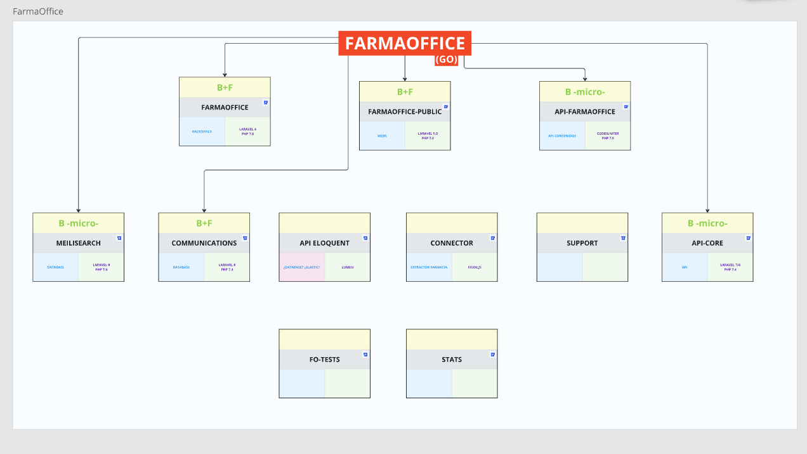
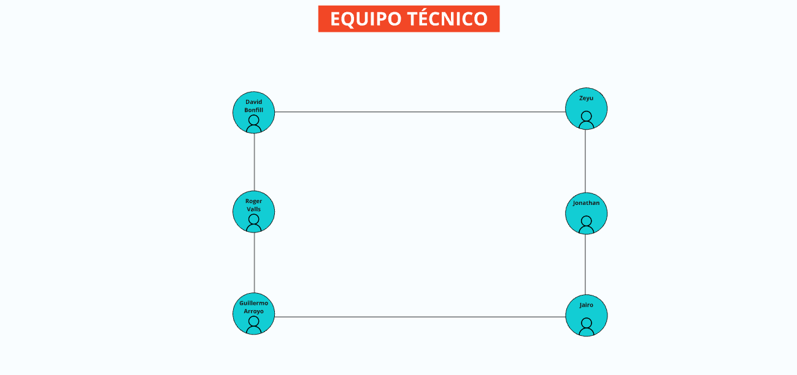

# Manual del desarrollador


<!-- ## Índice

- [Manual del desarrollador](#manual-del-desarrollador)
  - [FarmaOffice - Marzo 2023](#farmaoffice---marzo-2023)
  - [Índice](#índice)
  - [Conoce nuestro ecosistema y equipo](#conoce-nuestro-ecosistema-y-equipo)
    - [Ecosistema](#ecosistema)
    - [Equipo](#equipo)
  - [Instalación del equipo de desarrollo](#instalación-del-equipo-de-desarrollo)
    - [Herramientas principales](#herramientas-principales)
  - [Configuración GIT](#configuración-git)
  - [Configuración Bitbucket](#configuración-bitbucket)
    - [Añadir clave SSH](#añadir-clave-ssh)
      - [Clave SSH general](#clave-ssh-general)
      - [Clave SSH webmaster](#clave-ssh-webmaster)
  - [Instalación de proyecto FarmaOffice](#instalación-de-proyecto-farmaoffice)

--- -->

## Conoce nuestro ecosistema y equipo

### Ecosistema
**Farmaoffice**



**Farmacloud**


**Nextera**


### Equipo
<!-- En este **MIRO** verás un esquema de los diferentes departamentos con las personas que forman parte de ellos.

> *Si no puedes acceder a MIRO, regístrate usando este enlace con el correo de empresa.*

--- -->

**IT**


**COMERCIAL**


## Instalación del equipo de desarrollo

Por norma general, trabajamos con sistemas basados en **Linux** (Ubuntu u otras distros) e incluso **Mac**.

Para comenzar, necesitarás instalar las siguientes herramientas. Dependiendo de tu distro, sigue los pasos adecuados. En este manual, se describe la instalación en **Ubuntu 22.04**.

### Herramientas principales

| **Herramienta**              | **Descripción**                                                                                  |
|------------------------------|--------------------------------------------------------------------------------------------------|
| **Slack**                    | - Se recomienda usar **Slack Web** o **Rambox** en lugar de la aplicación de escritorio, ya que esta puede presentar problemas en Ubuntu. <br> - Consulta el documento sobre **buenas prácticas en comunicación de equipo**. |
| **PHPStorm**                 | - Se recomienda usar el mismo IDE entre compañeros para facilitar el soporte técnico. <br> - Si necesitas una licencia, solicítala. |
| **DBeaver**                  | - Cliente MySQL para conectarse a bases de datos. <br> - Puedes usar otro con el que te sientas cómodo. |
| **Docker y Docker-compose**  | - Necesarios para la ejecución de los proyectos. <br> - Opcional: **DockStation** para gestionar visualmente las instancias en ejecución. |
| **GIT**                      | - Instalar la última versión para interactuar con **Bitbucket**.                                 |
| **Sublime Text**             | - Editor de texto auxiliar. <br> - Puedes usar **VS Code** o cualquier otro.                    |
| **OpenFortiGUI**             | - Cliente VPN recomendado. <br> - Ubuntu 22.04 presenta problemas con la VPN, consulta el documento correspondiente. |
| **Filezilla**                | - Cliente FTP útil para acceder a entornos remotos.                                               |
| **Ásbrú Connection Manager** | - Facilita la conexión SSH. <br> - Puedes importar configuraciones existentes en *Digital Ocean*, *FarmaOffice* y *Fedefarma*. |

---


## Configuración GIT

Configurar **GIT** correctamente es clave para que los commits sean identificables:

```bash
git config --global user.name "Nombre Apellido"
git config --global user.email "usuario@bibloos.com"
```

Si usas más de un ordenador, asegúrate de que la configuración sea la misma en ambos.

> Más adelante, puedes explorar alias y otros comandos útiles.

---

## Configuración Bitbucket

Asegúrate de tener acceso a **Bitbucket** con la cuenta de empresa:

🔗 [Bitbucket Repositorios](https://bitbucket.org/dashboard/repositories)

Si no puedes ver los proyectos, solicita acceso a tus compañeros.

### Añadir clave SSH

Trabajar con **claves SSH** en Bitbucket permite realizar **clones, pulls y pushes** sin ingresar usuario y contraseña constantemente.

#### Clave SSH general

Para generar una clave SSH en un ordenador nuevo:

```bash
ssh-keygen -t ed25519 -C "user@bibloos.com"
```

Deja los campos en blanco y presiona *ENTER*.

Para visualizar la clave generada:

```bash
cat ~/.ssh/id_ed25519.pub
```

Copia el contenido y agrégalo en **Bitbucket**.

#### Clave SSH webmaster

Para acceder a repositorios especiales con el usuario `webmaster@bibloos.com`:

```bash
ssh-keygen -t ed25519 -o -C "user@bibloos.com" -f ~/.ssh/id_ed25519_webmaster
```

Luego, añade la clave en **Bitbucket** con el usuario *webmaster*.

---

## Instalación de proyecto FarmaOffice

Para instalar el proyecto principal de **FarmaOffice**, es necesario seguir varios pasos.

Se asume que ya tienes **Docker, GIT y las herramientas principales** instaladas.

Consulta este [documento](instalacion.md) actualizado con los pasos específicos para la instalación. Si encuentras algún problema, coméntalo en **Slack** con tu equipo.

📄 *Tómate tu tiempo, sigue los pasos y pregunta si tienes dudas.*
